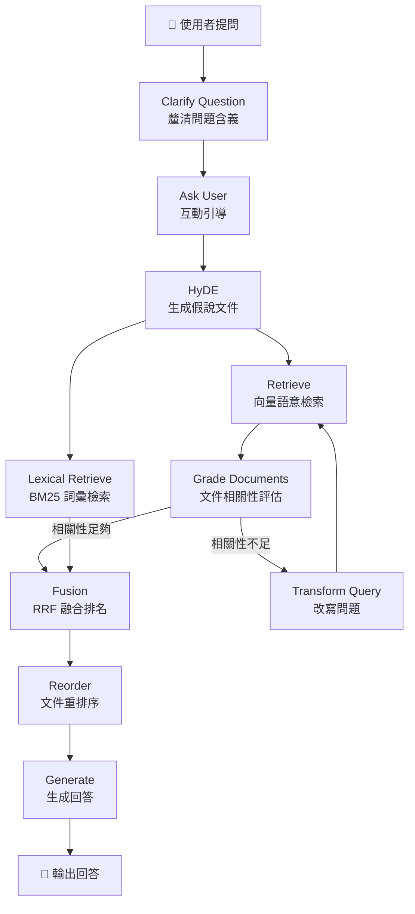

# 📒 Box-Note RAG

> 用 AI 搜尋你的筆記 — 基於 LangGraph 的個人知識庫問答系統

Box-Note 是一個個人筆記檔案庫，本專案透過 **RAG（Retrieval-Augmented Generation）** 技術，讓你可以用自然語言向自己的筆記提問，AI 會從筆記中檢索相關內容並生成回答。

## ✨ 功能特色

- 🔍 **混合檢索** — 結合向量語意檢索（Dense）與 BM25 詞彙檢索（Sparse），透過 RRF 融合排名取得最佳結果
- � **HyDE 假說文件** — 先讓 LLM 生成假說回答，再以此增強檢索品質
- �📄 **多格式支援** — 支援 Markdown (`.md`) 與 PDF (`.pdf`) 筆記匯入
- 🤖 **本地 LLM** — 使用 Ollama 運行本地模型，資料完全不外流
- 🧠 **問題釐清** — 自動分析並釐清用戶問題含義，提供互動式選項引導
- 🔄 **自動優化查詢** — 當檢索結果不佳時，自動改寫問題重新搜尋（含重試上限）
- � **文件重排序** — Fusion 後交替排列文件，將高相關文件放在 LLM 注意力最強的位置
- �📝 **對話紀錄** — 自動儲存每次問答紀錄至 JSONL 檔案
- 🎛️ **Prompt 版本管理** — 透過 YAML 管理 Prompt 模板，支援多版本切換
- ✅ **完整測試** — 使用 pytest 建構完整單元測試與整合測試，含覆蓋率報告

## 🏗️ 系統架構

本專案基於 **LangGraph** 建構一個有狀態的 RAG Pipeline，涵蓋問題釐清、HyDE、混合檢索、RRF 融合、文件重排序等進階技術：



| 節點 | 說明 |
|------|------|
| **Clarify Question** | 使用 LLM 分析並釐清用戶問題含義，生成多角度解讀 |
| **Ask User** | 互動式引導用戶選擇或提供更清楚的問題 |
| **HyDE** | 根據問題生成假說文件，合併原始問題增強檢索品質 |
| **Retrieve** | 從 ChromaDB 向量資料庫中進行語意檢索（Dense Retrieval） |
| **Lexical Retrieve** | 使用 BM25 進行詞彙層級檢索（Sparse Retrieval） |
| **Grade Documents** | 使用 LLM + Structured Output 逐一評估文件與問題的相關性 |
| **Transform Query** | 當相關文件不足時，自動改寫問題以優化搜尋（含重試上限） |
| **Fusion** | 使用 Reciprocal Rank Fusion (RRF) 融合兩路檢索結果，取 Top-5 |
| **Reorder** | 交替排列文件，將排名最高的文件放在 LLM 注意力窗口的頭尾位置 |
| **Generate** | 將篩選後的筆記作為上下文，生成最終回答 |

## 📁 專案結構

```
Box-Note-RAG/
├── app/
│   ├── config.py              # 環境變數與設定 (Pydantic Settings)
│   ├── factory.py             # LLM / Retriever / BM25 工廠函式 (cached)
│   ├── graph.py               # LangGraph 工作流定義
│   ├── io.py                  # 對話儲存、結構化輸出、流程圖輸出
│   ├── nodes.py               # 各節點邏輯 (10 個節點)
│   ├── schema.py              # Pydantic 結構化輸出 Schema
│   ├── state.py               # GraphState 型別定義 (含 reducer)
│   ├── prompts/
│   │   ├── manager.py         # Prompt 版本管理器
│   │   └── templates.yaml     # Prompt 模板 (支援多版本)
│   └── retriever/
│       ├── loaders.py         # 文件載入器 (Markdown / PDF)
│       ├── splitters.py       # 文本切片策略
│       └── vector_store.py    # ChromaDB 向量資料庫
├── scripts/
│   ├── ingest.py              # 筆記匯入腳本
│   ├── db_ops.py              # 向量資料庫管理工具
│   └── show_graph.py          # 流程圖生成腳本
├── tests/
│   ├── conftest.py            # 共享 Fixtures 與 Mock 設定
│   ├── test_config.py         # 設定模組測試
│   ├── test_graph.py          # 工作流結構測試
│   ├── test_io.py             # I/O 模組測試
│   ├── test_nodes.py          # 各節點單元測試
│   ├── test_prompts_manager.py # Prompt 管理器測試
│   └── test_splitters.py      # 文本切片測試
├── docs/                      # 文件與報告
├── data/                      # 向量資料庫與對話紀錄
├── main.py                    # CLI 主程式入口
├── Makefile                   # 常用指令快捷
└── pyproject.toml             # 專案依賴管理 (uv)
```

## 🛠️ 技術棧

| 類別 | 工具 |
|------|------|
| **LLM 框架** | LangChain / LangGraph |
| **本地模型** | Ollama (`llama3.2`) |
| **Embedding 模型** | Ollama (`qwen3-embedding:0.6b`) |
| **向量資料庫** | ChromaDB |
| **詞彙檢索** | BM25 (`rank-bm25`) |
| **套件管理** | uv |
| **設定管理** | Pydantic Settings + `.env` |
| **日誌** | Loguru |
| **Linter** | Ruff |
| **測試** | pytest + pytest-cov + pytest-html |

## 🚀 快速開始

### 前置需求

- Python 3.9
- [uv](https://docs.astral.sh/uv/) 套件管理工具
- [Ollama](https://ollama.ai/) 本地模型運行環境

### 安裝

```bash
# 1. Clone 專案
git clone https://github.com/CharlieAlex/Box-Note-RAG.git
cd Box-Note-RAG

# 2. 安裝依賴（含開發工具）
make venv

# 3. 設定環境變數
cp .env.example .env
# 依需求修改 .env 中的模型設定
```

### 下載 Ollama 模型

```bash
# LLM 模型
ollama pull llama3.2

# Embedding 模型
ollama pull qwen3-embedding:0.6b
```

### 匯入筆記

將你的筆記（`.md` / `.pdf`）放到指定資料夾，然後執行匯入：

```bash
make ingest DATA_PATH=/path/to/your/notes
```

### 開始提問

```bash
make run
```

程式會提示你輸入問題，接著自動從筆記中檢索並生成回答。

## 📊 資料庫管理

```bash
# 查看向量資料庫統計
make db-stats

# 直接測試向量檢索（不經過 LLM）
make db-search QUERY="你的搜尋關鍵字"

# 列出已匯入的所有文件來源
make db-sources
```

## 🧪 測試

```bash
# 執行所有測試（含 Ruff 檢查）
make test

# 僅執行單元測試
make test-unit

# 僅執行整合測試（需要 Ollama/Chroma）
make test-integration

# 產生 HTML 測試報告
make test-html
```

測試報告與覆蓋率報告將自動生成於 `docs/reports/` 目錄。

## 🔄 流程圖

```bash
# 產生 LangGraph 流程 PNG 與 Mermaid 文件
make show-graph
```

## ⚙️ 環境變數

| 變數 | 說明 | 預設值 |
|------|------|--------|
| `CHROMA_PATH` | ChromaDB 儲存路徑 | `data/chroma_db` |
| `EMBEDDINGS_MODEL` | Ollama Embedding 模型名稱 | `qwen3-embedding:0.6b` |
| `BATCH_SIZE` | 匯入時的批次大小 | `50` |
| `OLLAMA_MODEL` | Ollama LLM 模型名稱 | `llama3.2` |
| `DEBUG` | 除錯模式 | `false` |
